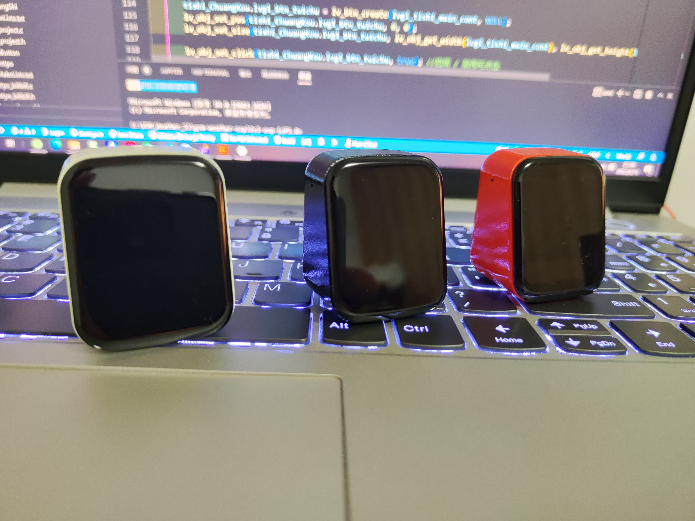

# gsm-weather-esp32s3-esp-idf5.0

#### 介绍

GSM_Wheather_S3 ESP32S3代码仓库，使用ESP32官方esp-idf-v5.0开发，需要安装相关开发环境。
 
视频演示地址：https://www.bilibili.com/video/BV1VU4y1v7VD?vd_source=2847f5d974d73d579ce40eb1213b09ff
 
字库UI设计开源地址:https://gitee.com/gsm-wheather-project/gsm-weather-s3-comprehensive-information
 
硬件开源地址：https://oshwhub.com/yeshengchengxuyuan/b4b67ab1e8234aeebea054b4eda6f549

食用过程中有疑问可以通过下面联系方式与我联系:
 
开源地址：https://gitee.com/gsm-wheather-project
 
微信:GM8988
 
QQ:1063503277
 
QQ交流群:709259833

#### 图片展示

 
更多外观图片：https://gitee.com/gsm-wheather-project/gsm-weather-s3-comprehensive-information/tree/master/%E5%A4%96%E8%A7%82

#### 软件架构
软件架构说明

#### 安装教程

1.  xxxx
2.  xxxx
3.  xxxx

#### 使用说明

1.  xxxx
2.  xxxx
3.  xxxx

#### 参与贡献

1.  Fork 本仓库
2.  新建 Feat_xxx 分支
3.  提交代码
4.  新建 Pull Request

#### 特技

1.  使用 Readme\_XXX.md 来支持不同的语言，例如 Readme\_en.md, Readme\_zh.md
2.  Gitee 官方博客 [blog.gitee.com](https://blog.gitee.com)
3.  你可以 [https://gitee.com/explore](https://gitee.com/explore) 这个地址来了解 Gitee 上的优秀开源项目
4.  [GVP](https://gitee.com/gvp) 全称是 Gitee 最有价值开源项目，是综合评定出的优秀开源项目
5.  Gitee 官方提供的使用手册 [https://gitee.com/help](https://gitee.com/help)
6.  Gitee 封面人物是一档用来展示 Gitee 会员风采的栏目 [https://gitee.com/gitee-stars/](https://gitee.com/gitee-stars/)
